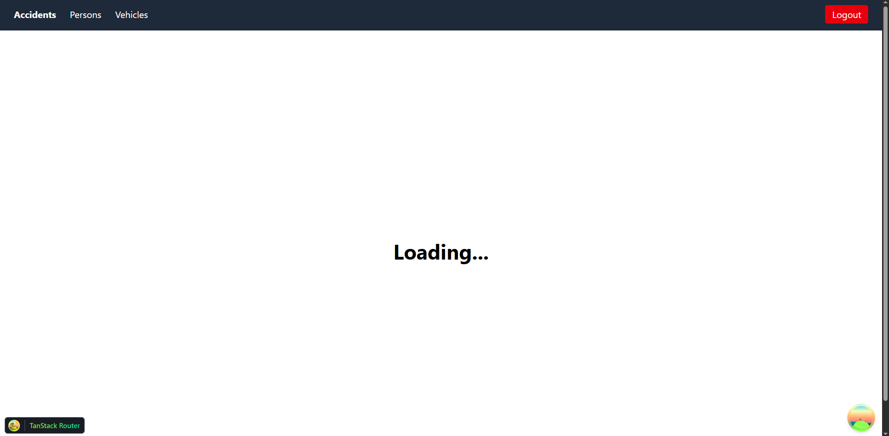
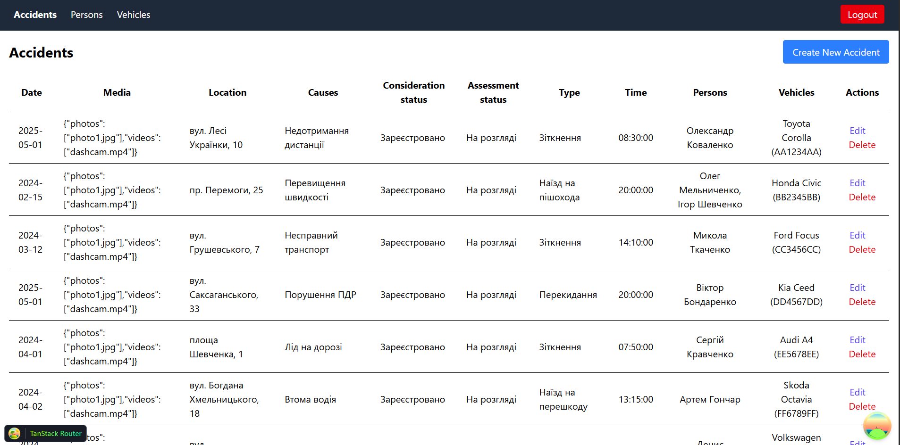
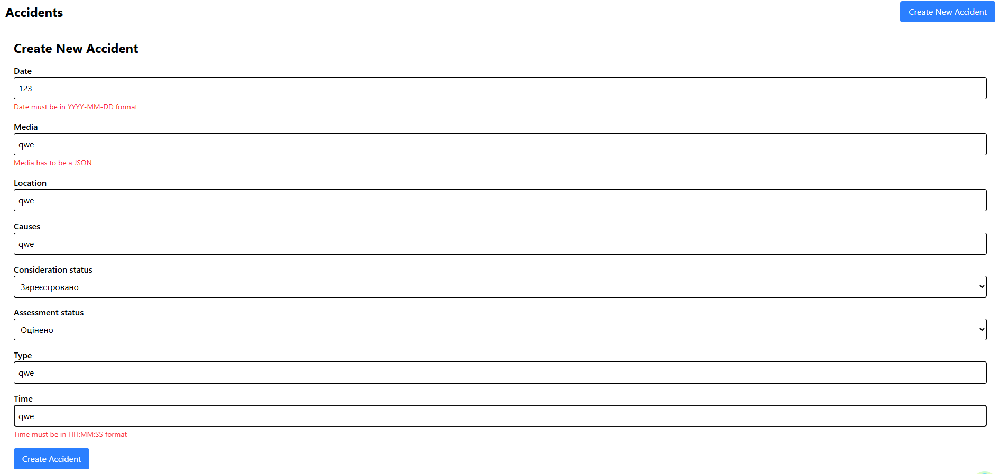
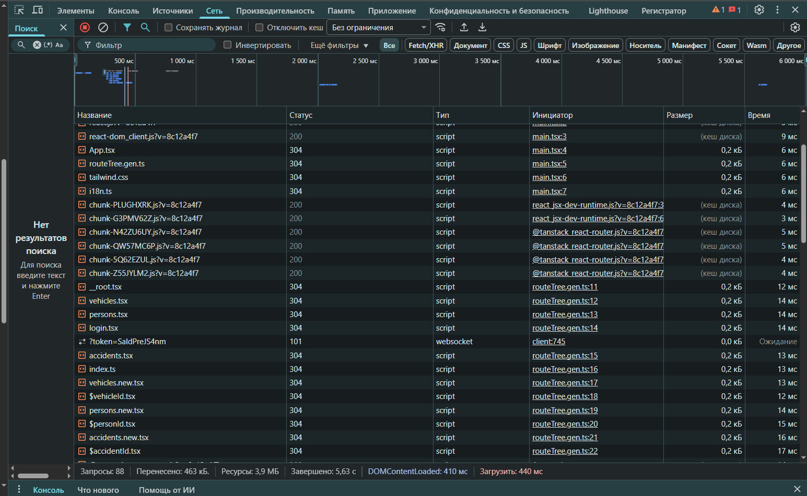
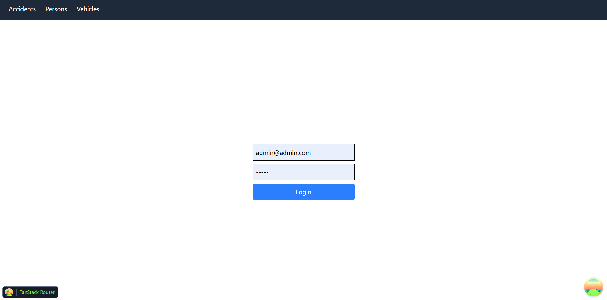

# Лабораторно-практична робота №8

### «Full-stack інтеграція: розробка UI на базі професійного бойлерплейту»

---

## Реалізований функціонал

У рамках лабораторної роботи створено клієнтський додаток для взаємодії з REST API, розробленим на попередніх етапах курсової роботи. Додаток реалізує CRUD-операції для основної сутності проекту. Використано сучасний бойлерплейт vite-react-boilerplate з інструментами: TanStack Query для керування серверним станом, TanStack Router для маршрутизації, React Hook Form із Zod для створення та валідації форм, Axios для виконання API-запитів. Також реалізовано сторінку логіну з використанням Zustand для збереження JWT-токену.

---

## Приклади ключового коду

### Конфігурація Axios

Налаштовано інстанс Axios із базовою URL-адресою з змінної оточення та обробкою помилок через інтерцептор.

```typescript
import axios, { isAxiosError } from "axios";
import { useAuthStore } from '../store/auth';

const apiClient = axios.create({
	baseURL: String(import.meta.env["VITE_API_BASE_URL"]),
	headers: {
		"Content-Type": "application/json",
	},
});

apiClient.interceptors.request.use((config) => {
	const token = useAuthStore.getState().token;
	if (token) config.headers.Authorization = `${token}`;
	return config;
});

apiClient.interceptors.response.use(
	(response) => response,
	(error: unknown) => {
		if (isAxiosError(error)) {
			console.error(`API error ${error.name}: ${error.message}`);
			if (error.response?.status === 401 || error.response?.data.errorMessage === 'Authorization header not provided') {
				const { clearToken } = useAuthStore.getState();
				clearToken();
				window.location.href = '/login';
			}
			return Promise.reject(error);
		}
		return;
	}
);

export default apiClient;
```

### Хуки для TanStack Query

Створено хуки для кожної CRUD-операції (список, отримання за ID, створення, оновлення, видалення) з використанням TanStack Query. Хуки включають логіку навігації та інвалідування кешу після мутацій.

Приклад хуків для `/accidents`:
```typescript
import type { UseMutationResult, UseQueryResult } from "@tanstack/react-query";
import { useMutation, useQuery, useQueryClient } from "@tanstack/react-query";
import { useNavigate } from '@tanstack/react-router';
import apiClient from '../../lib/axios';
import type { Accident } from './types';

const getAccidents = async (): Promise<Array<Accident>> => {
	const response = await apiClient.get('/accidents');
	return response.data as Array<Accident>;
}

const getAccidentById = async (id: string): Promise<Accident> => {
	const response = await apiClient.get(`/accidents/${id}`);
	return response.data as Accident;
}

const createAccident = async (newAccident: Omit<Accident, 'id'>): Promise<Accident> => {
	const response = await apiClient.post('/accidents', newAccident);
	return response.data as Accident;
}

const updateAccident = async ({ id, data }: { id: string, data: Partial<Accident> }): Promise<Accident> => {
	const response = await apiClient.patch(`/accidents/${id}`, data);
	return response.data as Accident;
}

const deleteAccident = async (id: string): Promise<void> => {
	await apiClient.delete(`/accidents/${id}`);
}

export const useAccidents = (): UseQueryResult<Array<Accident>, Error> => useQuery<Array<Accident>>({ queryKey: ['accidents'], queryFn: getAccidents });

export const useAccident = (id: string): UseQueryResult<Accident, Error> => useQuery<Accident>({ queryKey: ['accidents', id], queryFn: () => getAccidentById(id) });

export const useCreateAccident = (): UseMutationResult<Accident, Error, Omit<Accident, "id">, unknown> => {
	const queryClient = useQueryClient();
	const navigate = useNavigate();

	return useMutation({
		mutationFn: createAccident,
		onSuccess: async () => {
			await queryClient.invalidateQueries({ queryKey: ['accidents'] });
			await navigate({ to: '/accidents' });
		},
	});
};

export const useUpdateAccident = (): UseMutationResult<Accident, Error, { id: string, data: Partial<Accident> }, unknown> => {
	const queryClient = useQueryClient();
	const navigate = useNavigate();

	return useMutation({
		mutationFn: updateAccident,
		onSuccess: async (updatedAccident) => {
			await queryClient.invalidateQueries({ queryKey: ['accidents'] });
			queryClient.setQueryData(['accidents', updatedAccident.id], updatedAccident);
			await navigate({ to: '/accidents' });
		},
	});
};

export const useDeleteAccident = (): UseMutationResult<void, Error, string, unknown> => {
	const queryClient = useQueryClient();

	return useMutation({
		mutationFn: deleteAccident,
		onSuccess: async () => {
			await queryClient.invalidateQueries({ queryKey: ['accidents'] });
		}
	})
}
```

### Схема Zod

Розроблено схему Zod для валідації даних форми, що забезпечує перевірку введених даних перед відправкою на сервер.

Приклад схеми для `/accidents`:
```typescript
const accidentSchema = z.object({
    date: z.string().regex(new RegExp("^\\d{4}-(0[1-9]|1[012])-(0[1-9]|[12][0-9]|3[01])$"), "Date must be in YYYY-MM-DD format"),
    media: z.string().refine((value) => {
        if (value === "") return true;
        try {
            JSON.parse(value);
            return true;
        } catch {
            return false;
        }
    }, "Media has to be a JSON"),
    location: z.string().min(3, 'Location is too short'),
    causes: z.string().min(3, 'Causes are too short'),
    considerationStatus: z.enum(ConsiderationStatus, "Invalid consideration status"),
    assessmentStatus: z.enum(AssessmentStatus, "Invalid assessment status"),
    type: z.string().min(3, 'Type is too short'),
    time: z.string().regex(new RegExp("^\\d{2}:\\d{2}:\\d{2}$"), "Time must be in HH:MM:SS format"),
});
```

---

## Скріншоти

### Сторінка зі списком сутностей




### Форма з помилками валідації від Zod



### Вкладка Network у DevTools



### Сторінка логіну



---

## Коментарі щодо реалізації та деякі зустрінені труднощі

Реалізація базується на типізації з TypeScript для забезпечення безпеки даних. TanStack Query спростив керування серверним станом. Виникали труднощі з реалізацією parent/child логіки, оскільки спочатку не знав про `<Outlet />`. Також були деякі проблеми за валідацією JSON, які вирішено через парсинг JSON-рядку.
